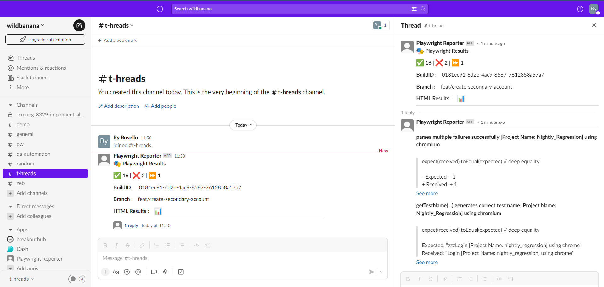

An example advanced configuration is shown below:

```typescript
  import { generateCustomLayout } from "./my_custom_layout";
  import { LogLevel } from '@slack/web-api';
  ...

  reporter: [
    [
      "./node_modules/playwright-slack-report/dist/src/SlackReporter.js",
      {
        channels: ["pw-tests", "ci"], // provide one or more Slack channels
        sendResults: "always", // "always" , "on-failure", "off"
        layout: generateCustomLayout,
        maxNumberOfFailuresToShow: 4,
        meta: [
            {
                key: 'BUILD_NUMBER',
                value: '323332-2341',
            },
            {
                key: 'WHATEVER_ENV_VARIABLE',
                value: process.env.SOME_ENV_VARIABLE, // depending on your CI environment, this can be the branch name, build id, etc
            },
            {
                key: 'HTML Results',
                value: '<https://your-build-artifacts.my.company.dev/pw/23887/playwright-report/index.html|📊>',
            },
        ],
        slackOAuthToken: 'YOUR_SLACK_OAUTH_TOKEN',
        slackLogLevel: LogLevel.DEBUG,
        disableUnfurl: true,
        showInThread: true,
      },

    ],
  ],
```

### **channels**

An array of Slack channels to post to, at least one channel is required

### **onSuccessChannels**

(Optional) An array of Slack channels to post to when tests have passed. Value from `channels` is used if not defined here

### **onFailureChannels**

(Optional) An array of Slack channels to post to when tests have failed. Value from `channels` is used if not defined here

### **sendResults**

Can either be _"always"_, _"on-failure"_ or _"off"_, this configuration is required:

- **always** - will send the results to Slack at completion of the test run
- **on-failure** - will send the results to Slack only if a test failures are encountered
- **off** - turns off the reporter, it will not send the results to Slack

### **layout**

A function that returns a layout object, this configuration is optional. See section below for more details.

- meta - an array of meta data to be sent to Slack, this configuration is optional.

### **layoutAsync**

Same as **layout** above, but asynchronous in that it returns a promise.

### **maxNumberOfFailuresToShow**

Limits the number of failures shown in the Slack message, defaults to 10.

### **slackOAuthToken**

Instead of providing an environment variable `SLACK_BOT_USER_OAUTH_TOKEN` you can specify the token in the config in the `slackOAuthToken` field.

### **slackLogLevel** (default LogLevel.DEBUG)

This option allows you to control slack client severity levels for log entries. It accepts a value from @slack/web-api `LogLevel` enum:

- ERROR
- WARN
- INFO
- DEBUG

Example: `slackLogLevel: "ERROR",` will only log errors to the console.

### **disableUnfurl** (default: false)

Enable or disable unfurling of links in Slack messages.

### **showInThread** (default: false)

Instructs the reporter to show the failure details in a thread instead of the main channel.



### **sendCustomBlocksInThreadAfterIndex** (default: undefined)

Instructs the reporter to send blocks provided by your [custom layout](./custom-layouts.md) to a thread following the index specified. _Example_:

`sendCustomBlocksInThreadAfterIndex: 3`

### **proxy** (optional)

String representation of your proxy server.
_Example_:

`proxy: "http://proxy.mycompany.com:8080",`

### **meta** (default: empty array)

The meta data to be sent to Slack. This is useful for providing additional context to your test run.

**Examples:**

```typescript
...
meta: [
  {
    key: 'Suite',
    value: 'Nightly full regression',
  },
  {
    key: 'GITHUB_REPOSITORY',
    value: 'octocat/telsa-ui',
  },
  {
    key: 'GITHUB_REF',
    value: process.env.GITHUB_REF,
  },
],
...
```
