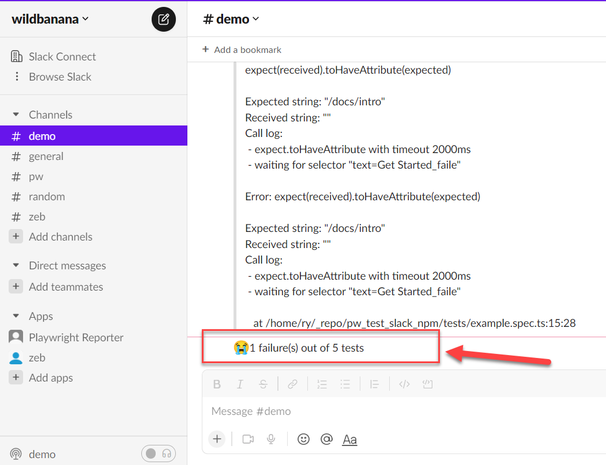
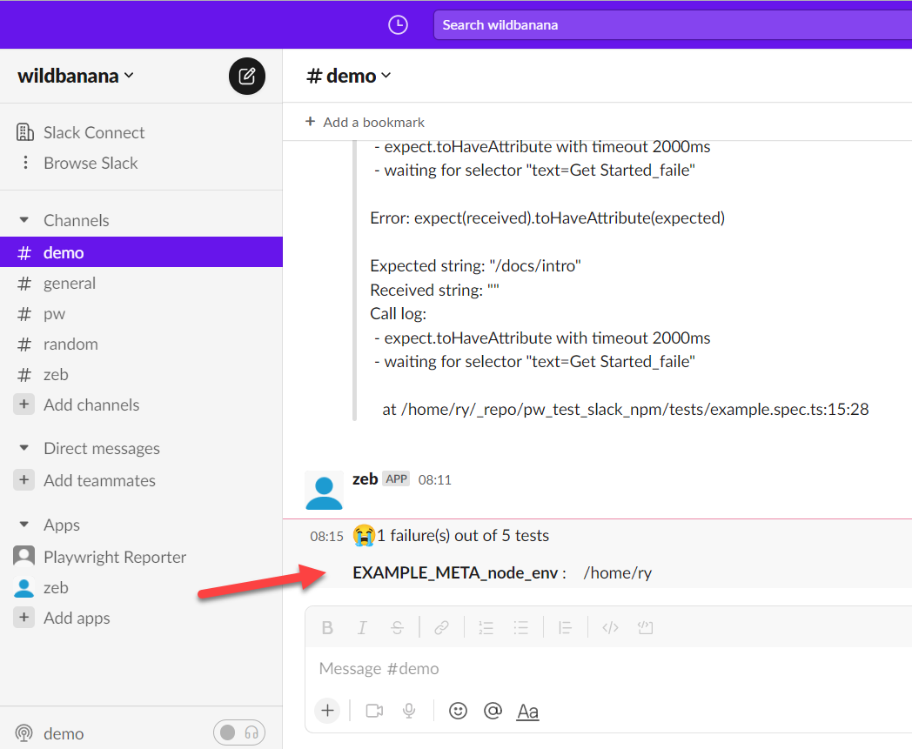

You can define your own Slack message layout to suit your needs.

Firstly, install the necessary type definitions:

`yarn add @slack/types -D`

Next, define your layout function. The signature of this function should adhere to example below:

```typescript
import { Block, KnownBlock } from '@slack/types';
import { SummaryResults } from 'playwright-slack-report/dist/src';

const generateCustomLayout = (
  summaryResults: SummaryResults,
): Array<KnownBlock | Block> => {
  // your implementation goes here
};

export { generateCustomLayout };
```

In your, `playwright.config.ts` file, add your function into the config.

```typescript
  import { generateCustomLayout } from "./my_custom_layout";

  ...

  reporter: [
    [
      "./node_modules/playwright-slack-report/dist/src/SlackReporter.js",
      {
        channels: ["pw-tests", "ci"], // provide one or more Slack channels
        sendResults: "always", // "always" , "on-failure", "off"
        layout: generateCustomLayout,
        ...
      },
    ],
  ],
```

> Pro Tip: You can use the [block-kit provided by Slack when creating your layout.](https://app.slack.com/block-kit-builder/)

### Examples:

**Example 1: - very simple summary**

```typescript
import { Block, KnownBlock } from '@slack/types';
import { SummaryResults } from 'playwright-slack-report/dist/src';

export default function generateCustomLayoutSimpleExample(
  summaryResults: SummaryResults,
): Array<Block | KnownBlock> {
  return [
    {
      type: 'section',
      text: {
        type: 'mrkdwn',
        text:
          summaryResults.failed === 0
            ? ':tada: All tests passed!'
            : `😭${summaryResults.failed} failure(s) out of ${summaryResults.tests.length} tests`,
      },
    },
  ];
}
```

Generates the following message in Slack:



**Example 2: - very simple summary (with Meta information)**

Add the meta block in your config:

```typescript
  reporter: [
    [
      "./node_modules/playwright-slack-report/dist/src/SlackReporter.js",
      {
        channels: ["demo"],
        sendResults: "always", // "always" , "on-failure", "off",
        layout: generateCustomLayout,
        meta: [
          {
            key: 'EXAMPLE_META_node_env',
            value: process.env.HOME ,
          },
        ],
      },
    ],
  ],
```

Create the function to generate the layout:

```typescript
import { Block, KnownBlock } from '@slack/types';
import { SummaryResults } from 'playwright-slack-report/dist/src';

export default function generateCustomLayoutSimpleMeta(
  summaryResults: SummaryResults,
): Array<Block | KnownBlock> {
  const meta: { type: string; text: { type: string; text: string } }[] = [];
  if (summaryResults.meta) {
    for (let i = 0; i < summaryResults.meta.length; i += 1) {
      const { key, value } = summaryResults.meta[i];
      meta.push({
        type: 'section',
        text: {
          type: 'mrkdwn',
          text: `\n*${key}* :\t${value}`,
        },
      });
    }
  }
  return [
    {
      type: 'section',
      text: {
        type: 'mrkdwn',
        text:
          summaryResults.failed === 0
            ? ':tada: All tests passed!'
            : `😭${summaryResults.failed} failure(s) out of ${summaryResults.tests.length} tests`,
      },
    },
    ...meta,
  ];
}
```

Generates the following message in Slack:



**Example 3: - With screenshots and/or recorded videos (using AWS S3)**

In your, `playwright.config.ts` file, add these params (Make sure you use **layoutAsync** rather than **layout**):

```typescript
  import { generateCustomLayoutAsync } from "./my_custom_layout";
  ...
  reporter: [
    [
      "./node_modules/playwright-slack-report/dist/src/SlackReporter.js",
      {
        ...
        layoutAsync: generateCustomLayoutAsync,
        ...
      },
    ],
  ],
  use: {
    ...
    screenshot: "only-on-failure",
    video: "retain-on-failure",
    ...
  },
```

Create the function to generate the layout asynchronously in `my_custom_layout.ts`:

```typescript
import fs from 'fs';
import path from 'path';
import { Block, KnownBlock } from '@slack/types';
import { SummaryResults } from 'playwright-slack-report/dist/src';
import { PutObjectCommand, S3Client } from '@aws-sdk/client-s3';

const s3Client = new S3Client({
  credentials: {
    accessKeyId: process.env.S3_ACCESS_KEY || '',
    secretAccessKey: process.env.S3_SECRET || '',
  },
  region: process.env.S3_REGION,
});

async function uploadFile(filePath, fileName) {
  try {
    const ext = path.extname(filePath);
    const name = `${fileName}${ext}`;

    await s3Client.send(
      new PutObjectCommand({
        Bucket: process.env.S3_BUCKET,
        Key: name,
        Body: fs.createReadStream(filePath),
      }),
    );

    return `https://${process.env.S3_BUCKET}.s3.${process.env.S3_REGION}.amazonaws.com/${name}`;
  } catch (err) {
    console.log('🔥🔥 Error', err);
  }
}

export async function generateCustomLayoutAsync(
  summaryResults: SummaryResults,
): Promise<Array<KnownBlock | Block>> {
  const { tests } = summaryResults;
  // create your custom slack blocks

  const header = {
    type: 'header',
    text: {
      type: 'plain_text',
      text: '🎭 *Playwright E2E Test Results*',
      emoji: true,
    },
  };

  const summary = {
    type: 'section',
    text: {
      type: 'mrkdwn',
      text: `✅ *${summaryResults.passed}* | ❌ *${summaryResults.failed}* | ⏩ *${summaryResults.skipped}*`,
    },
  };

  const fails: Array<KnownBlock | Block> = [];

  for (const t of tests) {
    if (t.status === 'failed' || t.status === 'timedOut') {
      fails.push({
        type: 'section',
        text: {
          type: 'mrkdwn',
          text: `👎 *[${t.browser}] | ${t.suiteName.replace(/\W/gi, '-')}*`,
        },
      });

      const assets: Array<string> = [];

      if (t.attachments) {
        for (const a of t.attachments) {
          // Upload failed tests screenshots and videos to the service of your choice
          // In my case I upload the to S3 bucket
          const permalink = await uploadFile(
            a.path,
            `${t.suiteName}--${t.name}`.replace(/\W/gi, '-').toLowerCase(),
          );

          if (permalink) {
            let icon = '';
            if (a.name === 'screenshot') {
              icon = '📸';
            } else if (a.name === 'video') {
              icon = '🎥';
            }

            assets.push(`${icon}  See the <${permalink}|${a.name}>`);
          }
        }
      }

      if (assets.length > 0) {
        fails.push({
          type: 'context',
          elements: [{ type: 'mrkdwn', text: assets.join('\n') }],
        });
      }
    }
  }

  return [header, summary, { type: 'divider' }, ...fails];
}
```

**Example 4: - Upload the attachments to directly to Slack**

To enable this functionality, make sure the slackbot user has the following additional scopes:

- `files:write`
- `files:read`

You will need to re-install the app and re-invite the bot into the channel.

The value of the channel_id should be the channel id of the channel you want to upload the file to. This channel id can be found in the url when you are in the channel. e.g.

**https://app.slack.com/client/T02RVEEFPDH/C05H7TKVDUK**

^ the bit starting with 'C...' is your channel id. In this case, the channel id is `C05H7TKVDUK`

```typescript
import web_api_1 from '@slack/web-api';
import fs from 'fs';
const slackClient = new web_api_1.WebClient(
  process.env.SLACK_BOT_USER_OAUTH_TOKEN,
);

async function uploadFile(
  filePath: string,
): Promise<web_api_1.FilesCompleteUploadExternalResponse[] | undefined> {
  try {
    const result = await slackClient.filesUploadV2({
      channel_id: 'C05H7TKVDUK', // << this is the channel id not channel name! ☠️
      file: fs.createReadStream(filePath),
      filename: filePath.split('/').at(-1),
    });

    return result.files;
  } catch (error) {
    console.log('🔥🔥 error', error);
  }
}

export default async function generateCustomLayout(
  summaryResults: SummaryResults,
): Promise<({ type: string; text: { type: string; text: string } } | Block)[]> {
  const header = {
    type: 'header',
    text: {
      type: 'plain_text',
      text: '🎭 *Playwright E2E Test Results*',
      emoji: true,
    },
  };

  const summary = {
    type: 'section',
    text: {
      type: 'mrkdwn',
      text: `✅ *${summaryResults.passed}* | ❌ *${summaryResults.failed}* | ⏩ *${summaryResults.skipped}*`,
    },
  };

  const fails: Array<KnownBlock | Block> = [];
  const { tests } = summaryResults;
  for (const test of tests) {
    if (test.attachments) {
      for (const attachment of test.attachments) {
        const uploadResult = await uploadFile(attachment.path);

        if (uploadResult && uploadResult[0].files) {
          const { name, permalink } = uploadResult[0].files[0];
          if (name === 'image' && permalink) {
            fails.push({
              alt_text: '',
              image_url: permalink,
              title: { type: 'plain_text', text: name || '' },
              type: 'image',
            });
          }

          if (name === 'video' && permalink) {
            fails.push({
              alt_text: '',
              // NOTE:
              // Slack requires thumbnail_url length to be more that 0
              // Either set screenshot url as the thumbnail or add a placeholder image url
              thumbnail_url: '',
              title: { type: 'plain_text', text: name || '' },
              type: 'video',
              video_url: permalink,
            });
          }
        }
      }
    }
  }
  return [header, summary, ...fails];
}
```
