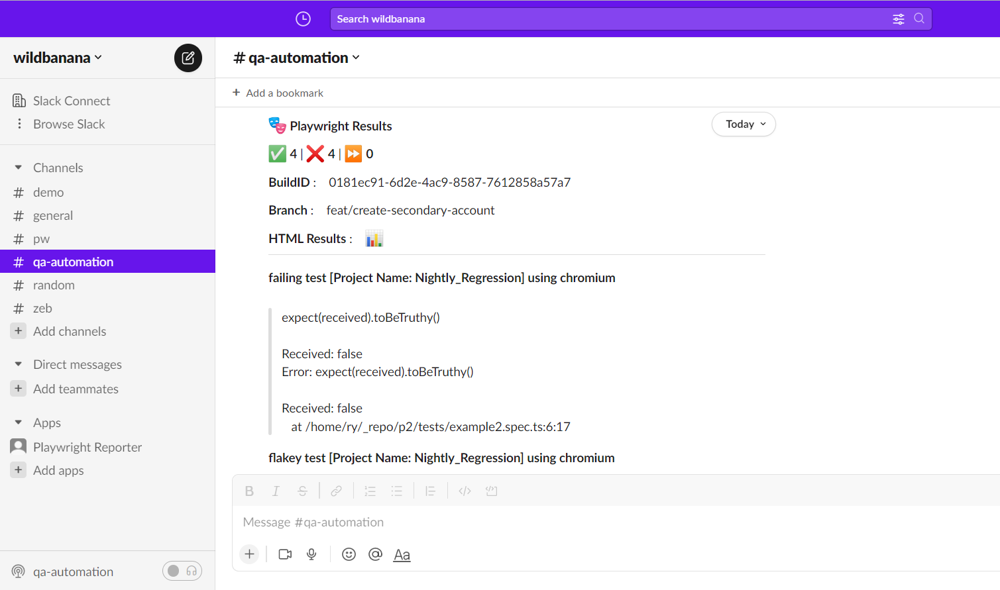

## Install

**yarn**

`yarn add playwright-slack-report -D`

**npm**

`npm install playwright-slack-report -D`

## Send your first report

Create an [incoming webhook](./webhooks.md) and set `SLACK_WEBHOOK_URL` in your environment. Add the reporter to `playwright.config.ts`:

```typescript
import { defineConfig } from '@playwright/test';

export default defineConfig({
  reporter: [
    [
      './node_modules/playwright-slack-report/dist/src/SlackReporter.js',
      {
        slackWebHookUrl: process.env.SLACK_WEBHOOK_URL,
        sendResults: 'always', // "always" , "on-failure", "off"
      },
    ],
    ['dot'], // other reporters
  ],
});
```

Run `npx playwright test`. The reporter posts a summary to your webhook's Slack channel when the run finishes.

## Choose your Slack connection

- [Incoming webhook](./webhooks.md): the shortest path to a report in one channel. Failure details appear inline.
- [Slack bot](./slack-bot.md): send to multiple channels and put failure details in a thread.

Configure one transport, then run your Playwright tests. Keep credentials in environment variables.

For sharded runs or existing JSON reports, use the [CLI](./cli.md). To control routing, metadata, and failure details, see [Configuration](./configuration.md).

## What you can build

Send reports to one or more channels, publish only when tests fail, include branch and build context, and define your own Slack message layout.


