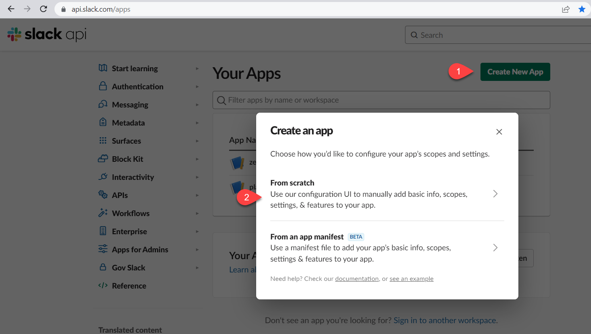
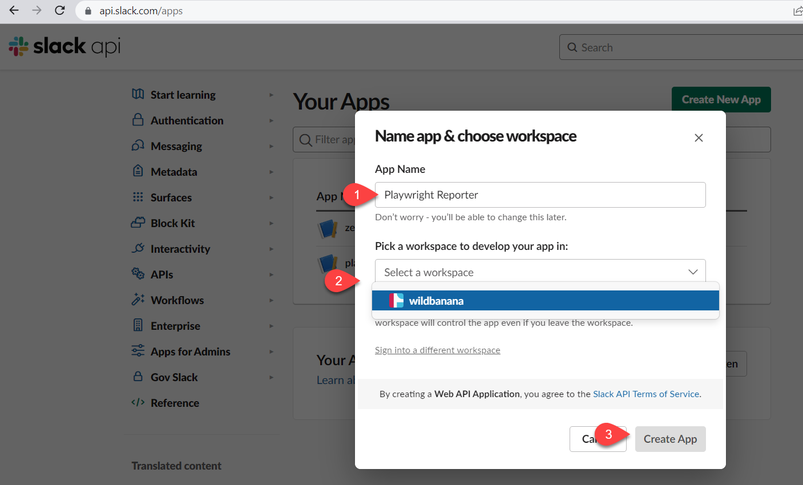
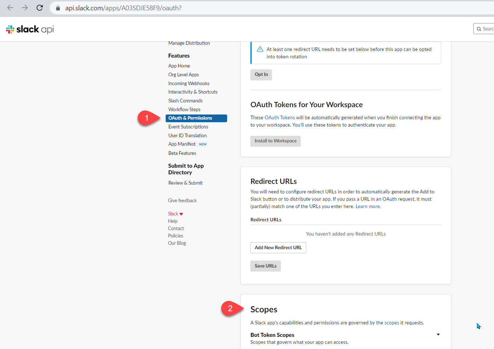
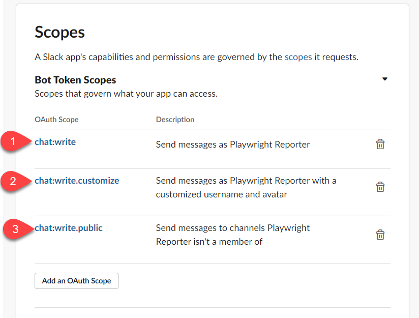
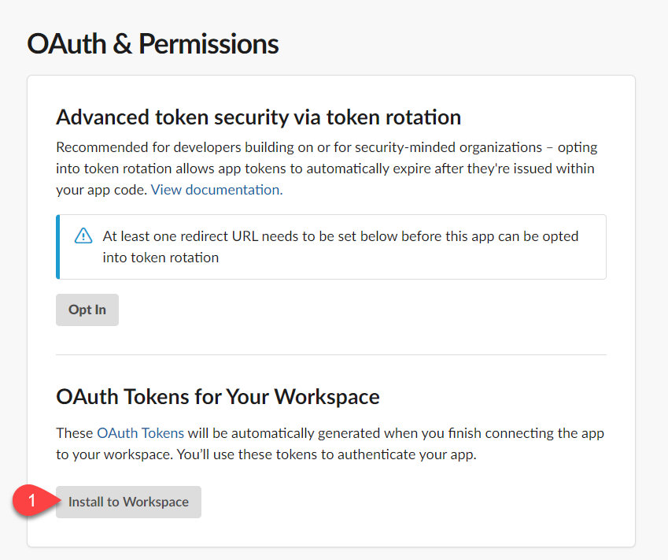
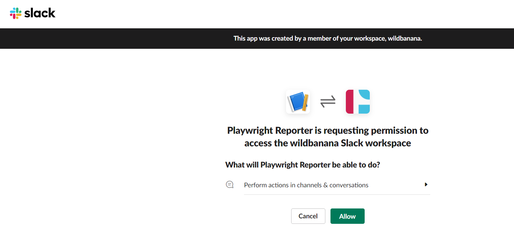
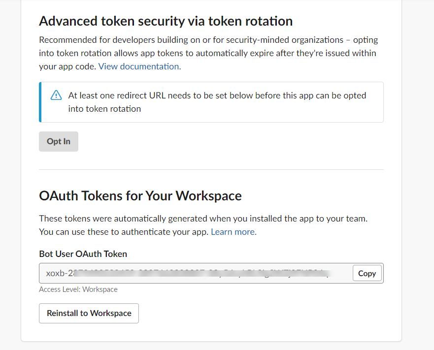

Configure the reporter with one or more channel names:

```typescript
import { defineConfig } from '@playwright/test';

export default defineConfig({
  reporter: [
    ['dot'],
    [
      './node_modules/playwright-slack-report/dist/src/SlackReporter.js',
      {
        channels: ['pw-tests', 'ci'],
        sendResults: 'always',
        showInThread: true,
      },
    ],
  ],
});
```

Run your tests by providing your `SLACK_BOT_USER_OAUTH_TOKEN` as an environment variable or specifying `slackOAuthToken` option in the config:

`SLACK_BOT_USER_OAUTH_TOKEN=[your Slack bot user OAUTH token] npx playwright test`

> **NOTE:** The Slack channel that you specify will need to be _public_, this app will not be able to publish messages to private channels.

---

<details>
<summary><b>🔎 How do I find my Slack bot oauth token?</b></summary>

You will need to have Slack administrator rights to perform the steps below.

1. Navigate to https://api.slack.com/apps
2. Click the Create New App button and select "From scratch"



3. Input a name for your app and select the target workspace, then click on the **Create App** button



4. Under the Features menu, select **OAuth & Permissions** and scroll down to **Scopes** section



5. Click the **Add an OAuth Scope** button and select the following scopes:



- chat:write
- chat:write.public
- chat:write.customize

6. Scroll up to the OAuth Tokens for Your Workspace and click the **Install to Workspace** button



> You will be prompted with the message below, click the Allow button



The final step will be to copy the generated Bot User OAuth Token aka `SLACK_BOT_USER_OAUTH_TOKEN`.

> **Treat this token as a secret.**



</details>

---
